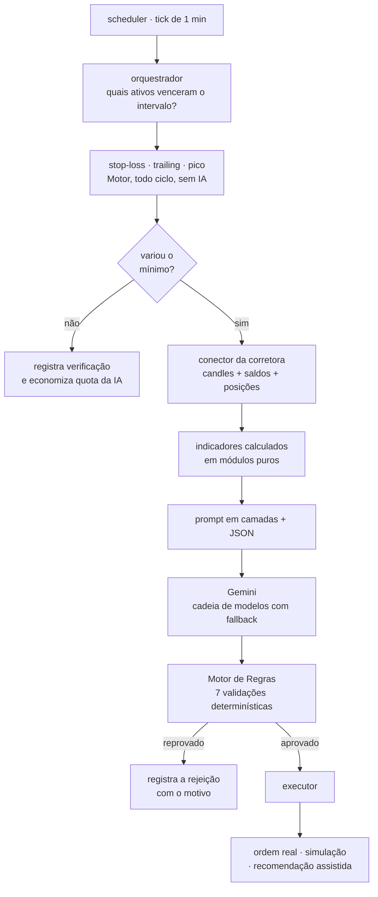

# IA Investidora — robô de trading multi-corretora com decisão por IA e Motor de Regras determinístico

Plataforma autônoma de análise e execução de operações que roda 24/7 em quatro
corretoras ao mesmo tempo — **Mercado Bitcoin** e **Binance** (cripto em BRL),
**Tastytrade** (ações dos EUA em USD) e **Toro** (ações/FIIs da B3, em modo
assistido). Para cada ativo o sistema coleta dados de mercado, calcula os
indicadores técnicos no próprio código, monta um prompt em camadas para o
**Gemini** decidir `COMPRAR` / `VENDER` / `AGUARDAR`, e submete essa decisão a um
**Motor de Regras determinístico** que tem sempre a última palavra.

| | |
| :--- | :--- |
| **Stack** | Node.js 22+ · JavaScript puro (ESM) · Firestore · Firebase Hosting/Auth · Gemini API |
| **Dependências de runtime** | **uma** (`firebase-admin`) — HTTP, WebSocket, assinatura HMAC e o painel web são todos sem framework |
| **Testes** | **443**, em `node:test` — sem Jest, sem mocks de biblioteca |
| **Tamanho** | ~10.800 linhas em `src/` (42 módulos) · ~7.200 de teste · ~3.900 no painel |
| **Em produção** | processo único numa VPS sob `pm2`, com deploy automático e heartbeat visível no painel |

> ℹ️ Esta é a **cópia pública** de um projeto pessoal em operação. Credenciais,
> ids de projeto e os números da carteira real foram substituídos por
> placeholders ou por descrições — o código e a documentação de engenharia estão
> completos. Não é recomendação de investimento.

---

## A ideia central: a IA opina, o código decide

O ponto de partida do projeto é uma desconfiança produtiva com LLMs: **modelo de
linguagem não é confiável para aritmética, e não deve ter acesso a nada.** Daí os
princípios que o resto da arquitetura serve:

- **A IA nunca calcula.** RSI, MACD, StochRSI, médias móveis, volatilidade,
  lucro líquido, taxas e orçamento são computados em módulos puros e chegam
  prontos ao prompt.
- **A IA nunca acessa rede, chave de API ou banco.** Ela recebe um JSON e devolve
  um JSON. É o único formato de contato.
- **A IA nunca é a última palavra.** Toda decisão passa pelo Motor de Regras, que
  revalida saldo, orçamento, ordens em aberto, divergência de preço, circuit
  breaker do dia e a regra de lucro — e pode reprovar.
- **A IA nunca sabe se está em simulação.** O fluxo até ela é idêntico; só o
  passo final de execução muda.
- **O núcleo não tem código específico de ativo.** `if (BTC)` é proibido:
  comportamento novo entra por configuração ou por um conector novo. Adicionar um
  ativo é cadastro, não código.

A regra mais rígida do sistema é **nunca vender no prejuízo por decisão da IA**,
avaliada **por lote** e com a taxa que a corretora de fato cobrou naquela compra.
Existem exatamente **duas** exceções, ambas determinísticas e ambas fora do
caminho da IA — o stop-loss e um modo de liquidação que só o dono liga. Elas
vivem em funções separadas justamente para que o caminho da IA continue
*estruturalmente incapaz* de aprovar um prejuízo.

## Fluxo de um ciclo



## As decisões de engenharia que valem olhar

| Problema real | Como foi resolvido |
| :--- | :--- |
| **A IA travava o portfólio inteiro** ao ver uma posição antiga no vermelho. | Cada compra abre um **lote independente**, com preço, taxas, chão e ciclo de vida próprios. A venda é validada lote a lote: um lote afundado não impede a realização dos outros. |
| **O stop-loss precisava rodar mais que a IA.** Uma queda pode furar o chão sem que a variação acumulada justifique gastar uma chamada de LLM. | O stop virou uma **via separada do Motor**, executada a cada ciclo, antes do filtro que decide se vale chamar a IA. Medido em produção: 127 ciclos para ~20 chamadas de IA. |
| **"Elevar o stop até o preço de entrada zera o risco" — é falso.** Nesse preço a posição ainda paga as duas pernas de taxa e sai no vermelho. | O breakeven virou uma **fórmula única e canônica**, usada nos três lugares que precisam concordar: o JSON da IA, a regra de venda e o trailing. Divergir faria a IA propor vendas que o Motor rejeitaria. |
| **O stop vinha dando prejuízo — e a causa não era o stop.** A IA subia o chão até colar no preço, ancorando em médias de 15 minutos; o ruído normal do dia matava o lote no zero. | Um número por ativo — a **folga mínima** — passou a governar toda distância de chão. A configuração do dono é o **piso** dela, e a IA só pode alargar. Diagnóstico feito com os dados de produção, incluindo o registro do que os números *não* sustentavam. |
| **A IA repetia o mesmo viés por dezenas de análises** e ninguém percebia. | Um **segundo agente**, semanal, audita o primeiro e reescreve uma camada do prompt dele. Ele não emite ordem, não toca em posição e não escreve no que o dono escreveu; um validador recusa a versão inteira e mantém a anterior se ele tentar mudar o formato de saída ou revogar uma regra. |
| **Uma métrica cega ninguém percebe.** Uma régua de risco ficou semanas inútil porque o campo que ela lia nunca era gravado. | Um teste lista, **por consumidor**, os campos que ele lê, e prova que uma posição criada pelo código de verdade os tem. Campo nulo é aceito; ausente nunca — `undefined` desaparece no JSON e a métrica passa a mentir "sem amostra". |
| **O Firestore cobra por leitura, e um tick de 1 minuto multiplica tudo por 1.440.** | Catálogo de configuração em cache com TTL, cada documento no escopo em que ele varia, estado de agendamento em memória e nenhuma query sem limite em coleção que cresce. Resultado medido: ~23 mil → ~5 mil leituras/dia. |
| **Um deploy automático que falhava no meio ficava irrecuperável.** A árvore no código novo, o processo no antigo, e todo tick seguinte dizendo "nada novo". | A régua do "já atualizado" deixou de ser a comparação de commits e passou a ser um **arquivo escrito só depois de instalar, testar e reiniciar com sucesso**. Falhou, tenta de novo no tick seguinte. |
| **O mascaramento de segredos no painel era cosmético.** A tela mostrava `••••1234`, mas o navegador baixava a credencial inteira. | As regras do Firestore passaram a **recusar leitura** dos documentos de segredo, aceitando só escrita. O painel exibe os 4 últimos caracteres lendo um espelho que o bot publica. As regras têm teste contra o emulador — errar ali expõe a chave ou tranca o dono fora do painel. |

## Documentação

O projeto é documentado em quatro níveis, e é onde está boa parte do trabalho:

| Arquivo | Para quem | O que tem |
| :--- | :--- | :--- |
| [CLAUDE.md](CLAUDE.md) | quem for manter o código | arquitetura, contratos de dados, as regras invioláveis e o *porquê* de cada mecanismo |
| [regras.md](regras.md) | quem quiser as regras de negócio | as regras de decisão e validação, sem código |
| [MANUAL.md](MANUAL.md) | o operador | como usar o painel no dia a dia, taxas, simulação × real, troubleshooting |
| [ROADMAP.md](ROADMAP.md) | curioso | o diário de bordo: cada versão, o que mediu, o que deu errado e o que foi **revertido** |

O ROADMAP é o mais honesto dos quatro. Tem uma camada inteira construída para uma
corretora e depois removida, uma correção que nasceu de descobrir que o
diagnóstico anterior estava errado, e várias medições que **não** sustentavam a
conclusão que se queria tirar delas — registradas assim mesmo.

## Estrutura

```
src/
├── scheduler.js       # entrada: saúde HTTP + persistência + migração + orquestrador
├── nucleo/            # orquestrador (fila multi-ativo), ciclo de UM ativo, catálogo em
│                      # cache, supervisor semanal, relatório de decisões, renda × CDI
├── indicadores/       # rsi, stochRsi, macd, mediasMoveis, volume, volatilidade — puros
├── regras/            # regrasEngine: a última palavra antes de qualquer execução
├── posicoes/          # lotes independentes por (plataforma, ativo)
├── executor/          # executor (real ou simulado) + simulador (carteira virtual)
├── conectores/        # contrato + mb/ bn/ tt/ toro/ — nada fora daqui fala com corretora
├── ia/                # iaClient (Gemini), montador do prompt em camadas, validadores
├── notificacoes/      # telegram — e o contrato de NUNCA lançar
├── firebase/          # única camada de persistência (Firestore ou memória)
└── utils/             # logger com redação de segredos, formatadores
dashboard/public/      # painel web: SVG puro para os gráficos, sem framework
tests/                 # 443 testes em node:test
.md/                   # as sementes dos prompts — versionadas como código
```

## Rodando

Requer **Node.js ≥ 22** (o conector da Tastytrade usa o WebSocket nativo) e um
projeto Firebase. Passo a passo completo em **[INSTALACAO.md](INSTALACAO.md)**.

```bash
npm install
npm test              # 443 testes, sem precisar de credencial nenhuma

cp .env.example .env  # preencha as chaves (nunca versionado)
npm start             # bot 24/7
```

Para explorar sem Firebase e sem corretora: `BOT_PERSISTENCIA=memoria npm start`.

## Licença

[MIT](LICENSE).
